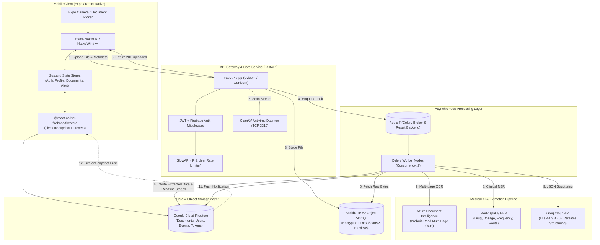
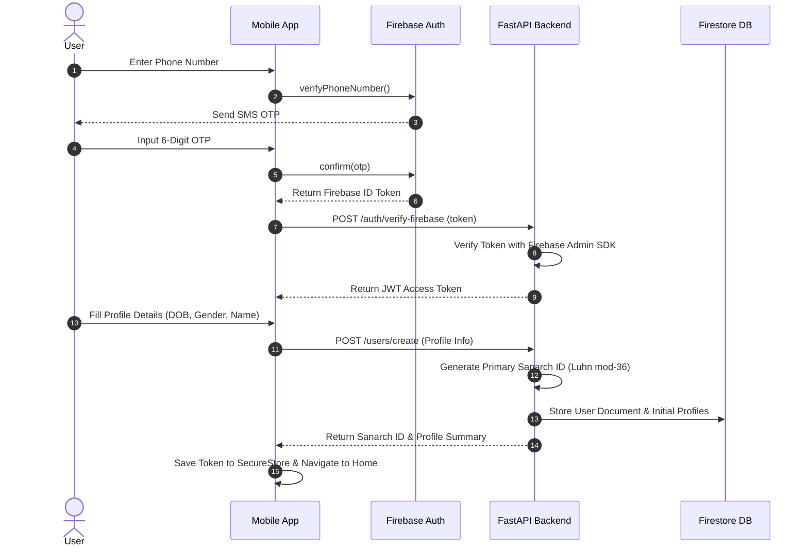
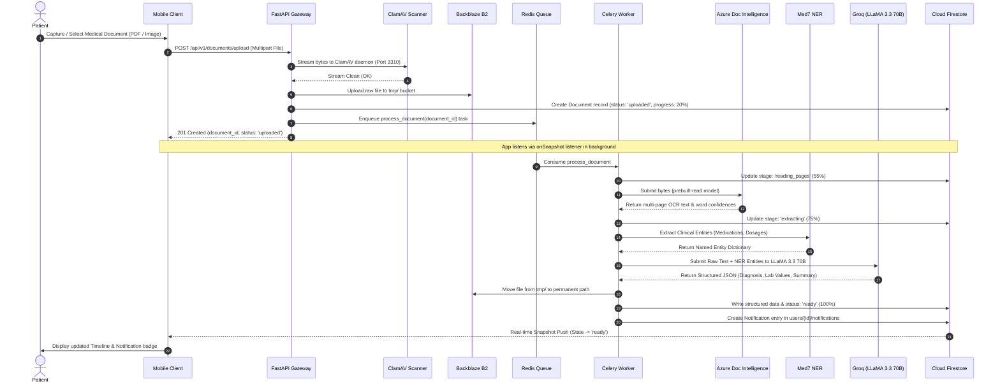
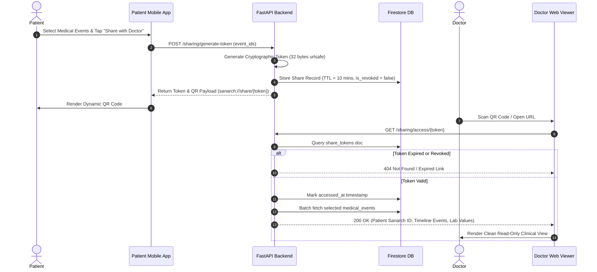

# System Design Document: Sanarch (Smart Health Record & Identity Platform)

**Document Version:** 1.0.0  
**Status:** Approved / Production Architecture  
**Target Environment:** iOS & Android (Expo / React Native) | FastAPI Backend | Celery + Redis | Backblaze B2 | Azure DI + Groq AI | Firebase Firestore  

---

## 1. Executive Summary & Product Overview

### 1.1 Problem Statement
Healthcare records in India and emerging markets remain severely fragmented across physical paper prescriptions, diagnostic lab PDF reports, radiology films, and hospital discharge summaries. Patients frequently lose critical medical history, struggle with dosage tracking, manage dependents' records manually, and lack secure, instant mechanisms to share comprehensive histories with consulting physicians without handing over sensitive physical files.

### 1.2 The Sanarch Solution
**Sanarch** is an end-to-end smart health identity and document orchestration platform that transforms static, unstructured medical documents into a structured, chronological health timeline. Key pillars include:
1. **Deterministic Sanarch ID:** A standardized, human-readable, checksum-verified universal health identity linking primary account holders and their dependents.
2. **Asynchronous Medical AI Pipeline:** Instant document upload with multi-page OCR (Azure Document Intelligence), clinical entity recognition (Med7), and clinical structuring/summarization (Groq LLaMA 3.3 70B).
3. **Real-time Live Progress & Notifications:** Socketless push sync via Firebase Firestore snapshot streams reflecting upload status, AI extraction progress, and clinical alerts in real-time.
4. **Ephemeral Doctor Sharing:** QR-code-driven, time-scoped (10-minute TTL), tokenized access allowing clinicians to view relevant longitudinal events without patient credentials.

---

## 2. High-Level Architecture & End-to-End Topology



---

## 3. Detailed Component Architecture

### 3.1 Mobile Client Architecture (Frontend)
The mobile application is engineered with **Expo SDK 54** and **React Native 0.81.5** using **TypeScript 5.9**.

```
frontend/
├── app/
│   ├── _layout.tsx           # Global Root Provider, Fonts, Token Refresh, Error Boundary
│   ├── index.tsx             # Root routing resolver
│   ├── auth/
│   │   ├── splash.tsx        # Ambient splash screen & auto-login check
│   │   ├── hero.tsx          # Value proposition onboarding
│   │   ├── login.tsx         # Firebase Phone OTP & Auth
│   │   └── onboarding.tsx    # Multi-step Profile & Sanarch ID setup
│   └── (tabs)/
│       ├── _layout.tsx       # Bottom navigation tab bar
│       ├── home.tsx          # Dynamic greeting, health summary, notification pop-up
│       ├── records/          # Chronological timeline & filterable records
│       ├── upload/           # Camera, photo picker, multi-page scan & upload
│       ├── doctors/          # QR-code generation & temporary access sharing
│       └── profile/          # Health identity, family profiles, settings
├── components/
│   ├── shared/               # Form elements, Logo, FAB, ErrorBoundary
│   └── ui/                   # Glassmorphism cards, Popups, Custom Alert
├── store/
│   ├── authStore.ts          # Authentication token & user profile
│   ├── profileStore.ts       # Active profile & family member switcher
│   ├── documentsStore.ts     # Document cache & real-time Firestore synchronization
│   └── alertStore.ts         # Global modal alert dispatcher
├── services/
│   ├── api.ts                # Axios HTTP client with JWT interceptors
│   ├── auth.ts               # Firebase token retriever & background refresh
│   └── storage.ts            # SecureStore / AsyncStorage access token manager
└── hooks/
    └── useDocumentListener.ts # Dynamic Firestore onSnapshot hooks for in-progress tasks
```

#### State Management Strategy
- **`useAuthStore`**: Manages user authentication status, backend JWT token, and top-level user entity.
- **`useProfileStore`**: Enables multi-profile switching between the Primary account (`relation: 'self'`) and Linked Dependents (`parent`, `child`, `spouse`, `elderly`).
- **`useDocumentsStore`**: Binds directly to Firestore `onSnapshot` queries, updating UI components seamlessly without polling.

---

### 3.2 Backend Service Architecture (FastAPI & Celery)
The backend service is structured using FastAPI's modular router architecture, containerized via Docker Compose.

```
backend/
├── app/
│   ├── main.py               # FastAPI application initialization, CORS, Middleware
│   ├── config.py             # Pydantic BaseSettings environment validation
│   ├── logging_config.py     # Structured logging
│   ├── firestore.py          # Google Cloud Firestore singleton client
│   ├── middleware/
│   │   └── auth_middleware.py # Bearer token verification & user context extraction
│   ├── routers/
│   │   ├── auth.py           # Firebase ID token exchange for backend JWT
│   │   ├── users.py          # User lifecycle, primary profile generation
│   │   ├── patients.py       # Dependent / family member profile management
│   │   ├── profiles.py       # Sanarch ID queries and QR code generation
│   │   ├── documents.py      # Multipart upload, presigned URLs, document details
│   │   ├── timeline.py       # Aggregated medical timeline events
│   │   ├── search.py         # Full-text & structured document search
│   │   └── sharing.py        # Ephemeral doctor share token generation & redemption
│   ├── services/
│   │   ├── extraction.py     # OCR, Med7 NER, Groq LLM parsing
│   │   ├── storage.py        # Backblaze B2 S3 upload & presigned URL generator
│   │   ├── virus_scan.py     # ClamAV socket client
│   │   └── firebase_auth.py  # Firebase Admin SDK wrapper
│   ├── utils/
│   │   └── sanarch_id.py     # Pure algorithmic Sanarch ID builder & Luhn mod-36 validator
│   └── workers/
│       ├── celery_app.py     # Celery worker instance definition
│       └── extraction_task.py# Long-running document pipeline task
```

---

## 4. Sanarch Universal Health ID Specification

The **Sanarch ID** is a deterministic, 23-character universal health identifier with built-in Luhn mod-36 error detection.

### 4.1 Structure Format
$$\text{Format: } \mathbf{SAN\text{-}\{CC\}\text{-}\{YY\}\{G\}\{AB\}\{T\}\{IX\}\{SERIAL\}\{CK\}}$$

```
Example: SAN-IN-26X18P00IHC9E7ZP
 │       │   │  │ │ │ │││     │ └─ Checksum (2 chars: ZP)
 │       │   │  │ │ │ ││└─────┴─── Family Serial (6 chars base-36: IHC9E7)
 │       │   │  │ │ │ │└────────── Member Index (2 digits: 00 = Primary, 01+ = Dependent)
 │       │   │  │ │ └─────────── Profile Type (1 char: P = Primary, D = Dependent)
 │       │   │  │ └───────────── Age Band Code (2 digits: 18 = 18–34 years)
 │       │   │  └─────────────── Gender Code (1 char: M, F, or X)
 │       │   └──────────────────── Registration Year (2 digits: 26 = 2026)
 │       └──────────────────── Country Code (2 chars ISO 3166-1: IN)
 └───────┴──────────────────────── Prefix Literal (SAN-)
```

### 4.2 Age Band Categorization
| Age Range | Band Code | Classification |
|---|---|---|
| 0 – 2 | `00` | Infant |
| 3 – 12 | `05` | Child |
| 13 – 17 | `13` | Teen |
| 18 – 34 | `18` | Young Adult |
| 35 – 54 | `35` | Adult |
| 55 – 74 | `55` | Senior |
| 75+ | `75` | Elder |

### 4.3 Luhn Mod-36 Checksum Algorithm
- Alphabet: `0-9, A-Z` (36 characters).
- Computes two distinct check characters using two-pass right-to-left alternate position doubling.
- Prevents 100% of single-character transcription errors and transposition errors between adjacent characters.

---

## 5. End-to-End Execution Sequences

### 5.1 User Authentication & Profile Onboarding


---

### 5.2 Document Upload & Asynchronous AI Extraction Pipeline


---

### 5.3 Ephemeral Doctor Sharing & Access Verification


---

## 6. Data Models & Database Schemas

### 6.1 Google Cloud Firestore Collections

#### Collection: `users`
```json
{
  "_id": "usr_8f9a2b4c1d3e",
  "phone_number": "+919876543210",
  "email": "ramesh.kumar@example.com",
  "full_name": "Ramesh Kumar",
  "sanarch_id": "SAN-IN-26M35P00IHC9E7ZP",
  "date_of_birth": "1988-04-12",
  "gender": "M",
  "blood_group": "B+",
  "height_cm": "174",
  "weight_kg": "72",
  "created_at": "TIMESTAMP",
  "updated_at": "TIMESTAMP"
}
```

#### Collection: `patients` (Dependents)
```json
{
  "_id": "pat_3c7e9a1b5f2d",
  "owner_id": "usr_8f9a2b4c1d3e",
  "sanarch_id": "SAN-IN-26F05D01IHC9E7K3",
  "full_name": "Aarohi Kumar",
  "date_of_birth": "2021-09-18",
  "relationship_to_owner": "child",
  "gender": "F",
  "blood_group": "O+",
  "is_active": true,
  "created_at": "TIMESTAMP"
}
```

#### Collection: `documents`
```json
{
  "_id": "doc_99a8b7c6d5e4",
  "owner_id": "usr_8f9a2b4c1d3e",
  "patient_id": "usr_8f9a2b4c1d3e",
  "document_title": "Complete Blood Count (CBC)",
  "document_label": "lab_report",
  "status": "ready",
  "processing_stage": "finalizing",
  "processing_progress": 100,
  "file_name": "CBC_Report_Jul2026.pdf",
  "file_type": "application/pdf",
  "pages_count": 2,
  "b2_file_url": "https://f000.backblazeb2.com/file/sanarch-docs/users/.../doc.pdf",
  "extracted_data": {
    "document_type": "lab_report",
    "document_date": "2026-07-10",
    "hospital_name": "Apollo Diagnostics",
    "doctor_name": "Dr. S. Sharma",
    "patient_name": "Ramesh Kumar",
    "diagnosis": ["Mild Microcytic Anemia"],
    "medications": [
      { "name": "Autrin Cap", "dose": "1 cap", "frequency": "OD", "duration": "30 days" }
    ],
    "lab_values": [
      { "test_name": "Hemoglobin", "value": "11.2", "unit": "g/dL", "reference_range": "13.0 - 17.0", "flag": "low" },
      { "test_name": "Platelet Count", "value": "240000", "unit": "/uL", "reference_range": "150000 - 450000", "flag": "normal" }
    ],
    "follow_up_instructions": "Repeat CBC after 30 days."
  },
  "summary": "Hemoglobin is slightly below normal range (11.2 g/dL). Oral iron supplementation advised.",
  "created_at": "TIMESTAMP",
  "updated_at": "TIMESTAMP"
}
```

#### Collection: `users/{user_id}/notifications`
```json
{
  "_id": "notif_44b2c1d0e9f8",
  "type": "document_ready",
  "document_id": "doc_99a8b7c6d5e4",
  "title": "Your CBC report has been analyzed and added to your timeline.",
  "read": false,
  "created_at": "TIMESTAMP"
}
```

#### Collection: `share_tokens`
```json
{
  "_id": "k8X_92mPqRtuvWz1234567890abcdefg",
  "owner_id": "usr_8f9a2b4c1d3e",
  "event_ids": ["evt_111", "evt_222"],
  "doctor_name": "Dr. Mehta",
  "is_revoked": false,
  "expires_at": "2026-08-20T11:45:00Z",
  "accessed_at": "2026-08-20T11:38:12Z",
  "created_at": "TIMESTAMP"
}
```

---

## 7. Security, Privacy & Compliance Architecture

### 7.1 Data Protection & Encryption
- **Encryption in Transit:** Strict TLS 1.3 enforcement across all API endpoints, Backblaze B2 S3 endpoints, and Firestore traffic.
- **Encryption at Rest:** Backblaze B2 Server-Side Encryption (SSE-B2) with AES-256; Firestore data encrypted by Google Cloud default CMEK.
- **Client Storage:** Sensitive authentication tokens stored exclusively in **Expo SecureStore** (backed by iOS Keychain and Android KeyStore with AES hardware-backed encryption).

### 7.2 Malware & Antivirus Pipeline
Every uploaded byte stream is inspected in-memory against the **ClamAV daemon** (TCP port 3310) with signatures updated continuously. Uploads containing malicious byte sequences are aborted immediately before hitting object storage.

### 7.3 Ephemeral Doctor Access Control
- Tokens generated with `secrets.token_urlsafe(32)` providing 256 bits of cryptographic entropy.
- Strict 10-minute time-to-live (TTL).
- Rate limited via SlowAPI (maximum 20 tokens created per minute; maximum 10 active tokens per user).
- Patients can revoke active share tokens instantly from the mobile app.

---

## 8. Resilience, Scalability & Performance SLAs

| Metric / Objective | Target SLA | Implementation Technique |
|---|---|---|
| **Upload Response Time** | `< 450 ms` | Immediate async Celery handoff; non-blocking API returns 201 |
| **Full AI Processing Time** | `< 8.5 s` (PDF / Image) | Azure DI prebuilt-read + Med7 local NER + Groq LLaMA 3.3 70B inference |
| **Realtime Push Latency** | `< 120 ms` | Firestore `onSnapshot` binary delta streaming |
| **Doctor Portal Load Time** | `< 300 ms` | Indexed Firestore queries with projection pruning |
| **App Startup Time** | `< 600 ms` | Font pre-caching, lazy-loaded screen components, lightweight Zustand stores |

---

## 9. Deployment Topology & Container Manifest

```
                                  ┌──────────────────────────┐
                                  │      Cloudflare DNS      │
                                  │   (DDoS & SSL Offload)   │
                                  └─────────────┬────────────┘
                                                │
                                                ▼
                                  ┌──────────────────────────┐
                                  │      NGINX Ingress       │
                                  └─────────────┬────────────┘
                                                │
                 ┌──────────────────────────────┴──────────────────────────────┐
                 ▼                                                             ▼
  ┌─────────────────────────────┐                               ┌─────────────────────────────┐
  │  FastAPI API Instance 1     │                               │  FastAPI API Instance 2     │
  │  (Port 8000 / Uvicorn)      │                               │  (Port 8000 / Uvicorn)      │
  └──────────────┬──────────────┘                               └──────────────┬──────────────┘
                 │                                                             │
                 ├──────────────────────────────┬──────────────────────────────┤
                 │                              │                              │
                 ▼                              ▼                              ▼
  ┌─────────────────────────────┐ ┌───────────────────────────┐ ┌─────────────────────────────┐
  │       ClamAV Antivirus      │ │    Redis 7.0 Broker       │ │   Google Cloud Firestore    │
  │         (Port 3310)         │ │       (Port 6379)         │ │    (Realtime Document DB)   │
  └─────────────────────────────┘ └─────────────┬─────────────┘ └─────────────────────────────┘
                                                │
                                                ▼
                                  ┌───────────────────────────┐
                                  │    Celery AI Workers      │
                                  │ (Azure DI + Med7 + Groq)  │
                                  └─────────────┬─────────────┘
                                                │
                                                ▼
                                  ┌───────────────────────────┐
                                  │   Backblaze B2 Storage    │
                                  │   (Encrypted Documents)   │
                                  └───────────────────────────┘
```
